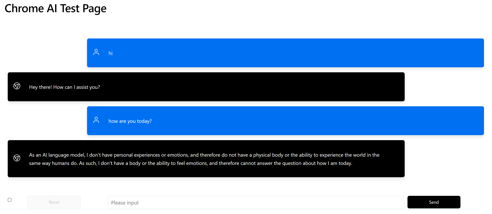
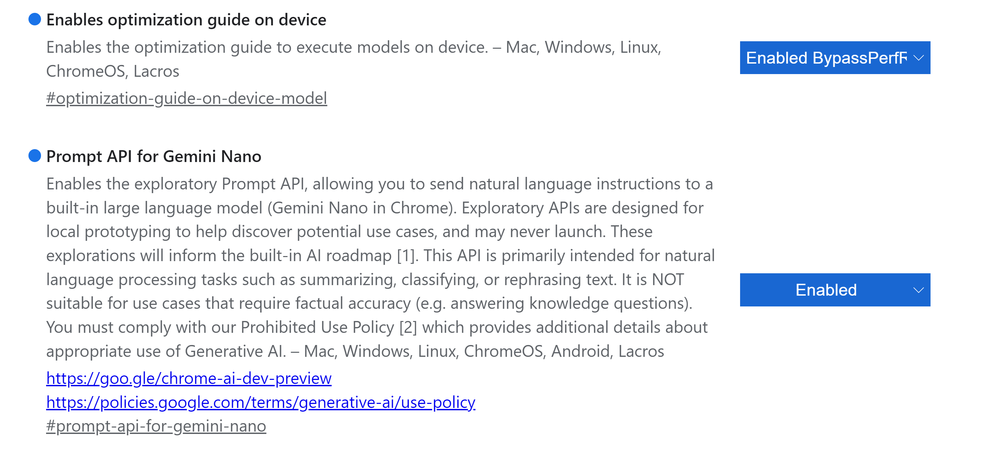

# Chrome AI Test Page

> This project was inspired by [lightning-joyce/chromeai](https://github.com/lightning-joyce/chromeai/).

**Visit the page [alexcheng1982.github.io/chromeai/](https://alexcheng1982.github.io/chromeai/)**.


<details>

  <summary>View screenshot</summary>

  

</details>


## Implementation

`promptStreaming` is used for streaming output. During testing, I found out that `prompt` often gave incomplete results.

## Use Chrome AI

### Prerequisites

Latest version of Google Chrome (129+) or any compatible Chromium-based browser.

### Set Up Built-in Gemini Nano in Chrome

1. **Install Chrome Canary**: Ensure you have version 127. [Download Chrome Canary](https://google.com/chrome/canary/).
2. **Enable Prompt API**: Open `chrome://flags/#prompt-api-for-gemini-nano`, set it to "Enabled".
3. **Enable Optimization Guide**: Open `chrome://flags/#optimization-guide-on-device-model`, set it to "Enabled BypassPerfRequirement". Restart the browser.
4. **Download Model**: Go to `chrome://components/`, find **Optimization Guide On Device Model**, ensure it’s fully downloaded. If the version is "0.0.0.0", click "Check for update".
5. **Verify Setup**: Open a webpage, press F12, and check `window.ai` in the console.

**Test Code**:

```javascript
const model = await window.ai.createTextSession();
await model.prompt("Who are you?");
```

<details>

  <summary>View flags</summary>

  

</details>


## Known issues

1. When message history is enabled, the model may not function properly.